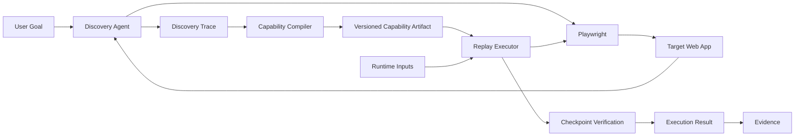

## Architecture

### Tech Stack
- **Backend:** Python, Flask
- **Frontend:** HTML, CSS, JavaScript
- **Browser Automation:** Playwright
- **LLM Integration:** OpenAI API
- **Schema & Validation:** Pydantic
- **Testing:** pytest
- **Persistence / Artifacts:** JSON
- **Target Application:** Flask, HTML, CSS, JavaScript

### System Architecture

### Architecture Design

The system seperates LLM-driven workflow discovery from deterministic workflow execution.

During discovery, the user provides a goal and the discovery agent observes the live application through Playwright. The LLM determines the next action based on the current UI state. This observe-decide-act cycle continues until the goal is completed or the agent reaches a stopping condition.

A successful discovery trace is passed to the capability compiler. The compiler converts the discovered interaction sequence into a typed and versioned Capability artifact containing runtime inputs, ordered actions, targets, outputs, checkpoints, and a final success condition.

For subsequent executions, the replay executor loads saved capability and supplies runtime inputs. Replay does not use LLM to decide what action to perform. Instead, it executes the previously compiled actions through Playwright and verifies checkpoints to determine whether execution matches the expected workflow.

Safety, evidence collection, and human handoff support the execution lifecycle. Guardrails define permitted actions and application boundaries; evidence records execution results and richer failure signals; and handoff allows automation to pause while a human takes control of the same live browser session before returning control to automation.

## Artifact Schema

The discovered workflow is compiled into a typed, serializable and versioned `Capability` artifact using Pydantic. The artifact acts as the contract between LLM-driven discovery and deterministic replay. 

### Capability

`Capability` is the top level representation of a reusable workflow. It contains:

- `Name` - identifier for the reusable workflow
- `Version` - identifies which revision of the capability you're using
- `description` - Human readable explanation of the workdlow
- `inputs` - Values supplied when running the window
- `outputs` - results the workflow is expected to produce
- `actions` - steps the executor follows
- `success_condition` - the final condition that must hold for the capability to succeed
  
### Inputs and Outputs

 - `InputParameter` Describes an input accepted by the capability at runtime. It includes the input's name, type, whether its required, and an optional description.
 - `OutputParameter` Describes an output produced by the capability. It includes the output's name, type, and an optional description.
  
### Actions

Each `Action` represents one deterministic operation. Supported action
types include `type`, `click`, `extract`, `wait`, and `navigate`.

An action can contain a target, runtime value, checkpoint, retry policy, output binding (`save_as`), and risk level. Actions are stored in order so the replay executor can reproduce the discovered workflow without asking the LLM what to do next.

### Targets

`Target` describes how an element should be located in the UI. Targets can use semantic information such as role, label, or accessible name, as well as a selector when necessary.

For example, the member search input can be represented by its label, while account balance extraction uses selectors identifying the appropriate
table cells.

### Checkpoints

`Checkpoint` represents an expected state that can be verified during execution. Supported conditions may include visibility, non-visibility, URL and text containment.

Checkpoints may be attached to individual actions, while the capability also defines a final `success_condition`. This prevents replay from testing successful browser interaction alone as proof that the workflow achieved its intended result. 

### Versioning and Serialization

Capabilities contain an explicit version and are serialized to JSON. This
allows a discovered workflow to be persisted, inspected, loaded later, and
replayed independently of the discovery agent.

## Determinism & error handling

The system seperates LLM driven discovery from deterministic replay. During discovery, the model chooses actions based on page observations. After discovery succeeds, the compliler converts recorded actions into a JSON capability containing an ordered action sequence, predefined targets, runtime input placeholders, and checkpoints. Replay executed this artifacr without model calls, following the saved order substituting supplied values such as member_id.

Determinisim applies to the execution procedure, not to guaranteed outcomes. Application data, page timing, and UI structure can change between runs. Fixed selectors and explicit checkpoints make replay predictable and inspectable, but do not eliminate these dependencies. 

Before ececution, Pydantic validates the artifact structure and action requirements. For example, extraction actions require a target and an output name, and that name must match a declared output. During replay, missing placeholder inputs, browser errors, and failed checkpoints are caught and converted into a structure HARD_FAILURE result. This included the failing step, error message, and outputs collected before the failure.

Expected exceptional states are handled separately. After a click, the executor checks for “Member not found” and returns BUSINESS_OUTCOME, distinguishing an unsuccessful lookup from a technical failure. Attached checkpoints verify intermediate conditions, and the final success condition must pass before SUCCESS is returned.

UI drift is detected indirectly through locator failures, timeouts, or checkpoint mismatches. Automatic target repair, retries, and escalation are not implemented. Visibility checks wait for the required state, while URL and text checks compare immediately. Discovery exceptions currently propagate to the caller rather than returning the replay executor’s structured failures.

## Heterogenity & Multi-Tenant

The current system supports a web application using Playwright. To support other interfaces, such as older websites or desktop applications, it would need different ways to locate elements and perform actions. The same workflow concepts could be reused, but the browser specific targets and execution code may need to be adjusted.

Multiple institutions using the same application could share a common workflow, with seperate configuration for their website addresses, credentials, and any interface differences. Each insitution would also need separate browser sessions and evidence storage to keep its data isolated. 

These are future extensions. The current prototype supports one mock application and does not implement tenant isolation.

## Escalation & handoff

Replay escalates to a human when a supported checkpoint fails and automation cannot safely continue. This includes a failed WAIT checkpoint, a checkpoint after an action has completed, or the final success condition. The handoff controller records the capability, failing step, and reason, then pauses execution while keeping the same browser session open. The operator corrects the page manually and chooses to resume or abort through the terminal.

Before resuming, the operator describes the manual change without including sensitive details. The executor verifies that the page remains within the allowed application and that the checkpoint now passes. Failed verification leaves automation paused; successful verification returns control to replay. Choosing abort stops the run. The system records handoff events and failure evidence, including a structural page summary. It does not automatically repeat clicks or allow human resume to bypass policy restrictions.

Stuck detection is deliberately limited: replay uses failed checkpoints as intervention signals, while discovery has a maximum-step limit and reports blocked actions or execution errors. Discovery does not yet support resumable handoff, and replay stops on action failures that lack a safe, verifiable continuation point. The terminal-based operator interface keeps the implementation simple while demonstrating real control transfer in the same live session.

## Safety

Discovery and replay check actions against an allowlist before execution. Only approved inputs, buttons, and application origins are permitted. Risky actions and external redirects are blocked, and human resume cannot bypass these checks.

Logs redact sensitive fields, while failure snapshots exclude page text and input values. However, free-text notes and screenshots may still contain sensitive information. Discovery also sends page observations to the model. These controls support the synthetic-data demo; they are not a complete production security boundary.

## Cuts

I limited the prototype to one mock web application and a member-balance workflow. Desktop automation, multi-tenant infrastructure, automatic UI repair, and a full operator dashboard were left out to keep the implementation focused. Human control uses the local browser and terminal instead of a remote console.

Next, I would add discovery-side handoff, stronger detection of repeated actions without progress, and stricter runtime input/output validation. I would then introduce surface adapters and tenant-specific configuration to reuse capabilities across different application environments.
